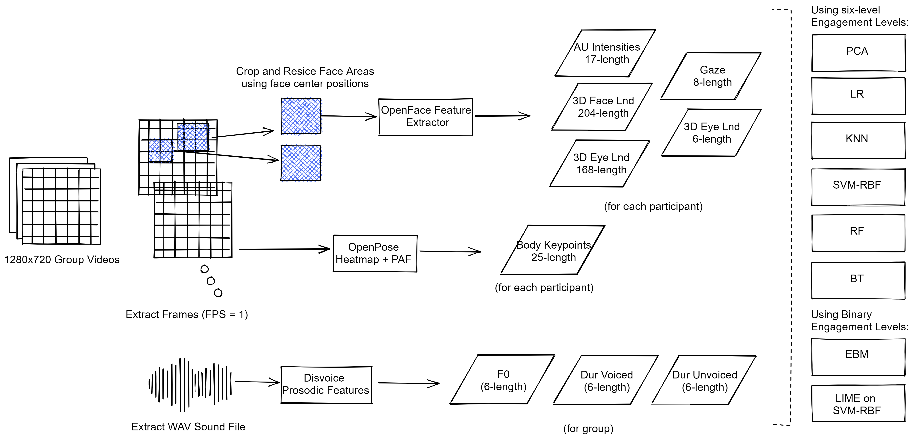
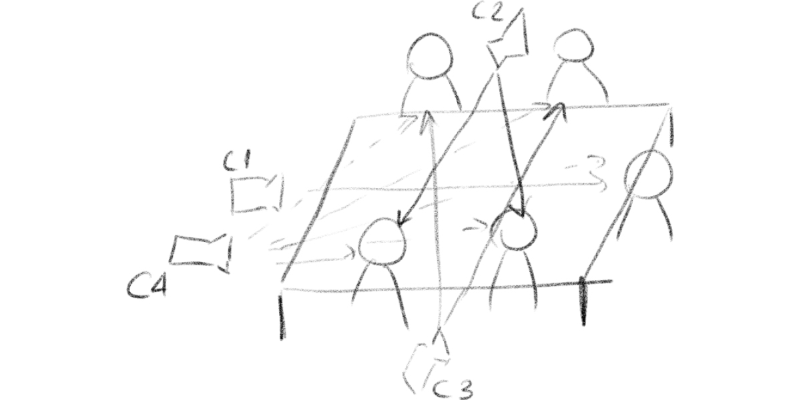
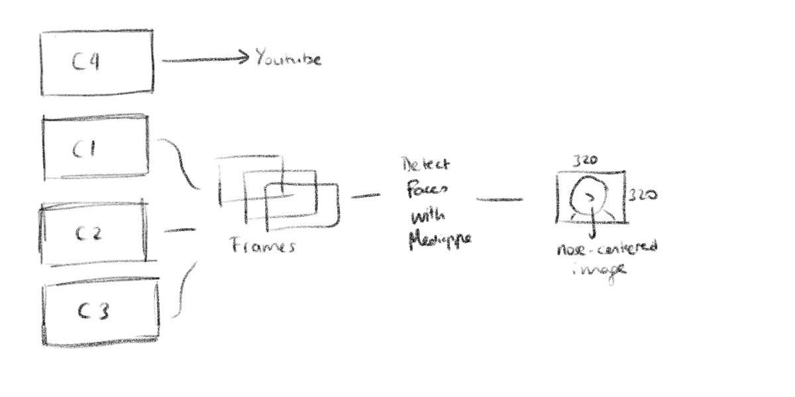

# Engagement Analysis Experiments

_Classroom Engagement using our custom video data._

This repo contains the data pipeline and experiments for our new audiovisual dataset containing group studies with engagement level annotations. A summary of our data pipeline is depicted in the below diagram:



## Citing this Dataset and Research

If you are using the dataset, code or research insights in your work, please cite the corresponding papers:

```
@article{sabuncuoglu2023dataset,
  title={Multimodal Group Activity Dataset for Classroom Engagement Level Prediction},
  author={Sabuncuoglu, Alpay and Sezgin, T Metin},
  journal={arXiv preprint arXiv:},
  year={2023}
}

```

## Download Data

Run the following command:

```
ipython data-pipeline/download_dataset_wget.py
```


## Data Collection and Pre-processing: Step-by-Step

Our Classroom Engagement Dataset contains video recordings of group of students learning a creative coding framework and completing some hands-on activities.  Total of four cameras record the group interactions and facial features. C1, C2 and C3 record faces directly, and C4 records the all group members.



Our data collection and pre-processing steps can be summarized with the steps below: 

1. Sliced videos (~5 minute chunks) for the annotation process. [Script](./data-pipeline/slice_video.ipynb)
2. Collected self-evaluation scores from the participants. [Methodology Documentation](https://docs.google.com/document/d/1lxcu4fFcIoxhDowtJg7T_g7i9eVbBFS_d_EKvAv1TwU/edit?usp=sharing)
3. Converted individual CARMA CSVs to combined CSVs and determined group engagement levels and scores. [Script](./scores/k-based-score.ipynb)
4. Uploaded the slice of group video recordings to Youtube. [Youtube Video List](./data-pipeline/youtube_links.csv)
5. Created WAV files for Disvoice analysis and extract Whisper transcripts. [Script](./data-pipeline/mp4_to_wav.ipynb)
6. Obtain frames for each second. [Script](./data-pipeline/convert_to_frames.ipynb)
7. Obtain centered (nose) and cropped (320x320) faces. [Script](./data-pipeline/mp-face-detector.py)
8. Sliced videos based on their engagement levels of video action classificiation type of task. [Script](./data-pipeline/slice_based_on_levels.ipynb)




## Facial Detection and Obtaining Features

- MediaPipe can detect faces very fast and accurate. It is also easy to use. You can use the following notebook to use MediaPipe Face Detection: [MediaPipe Face Detection Notebook](./face-analysis/mediapipe_face_detection.ipynb)
- We primarily used OpenFace features in our face analysis module. Our OpenFace is version 2.2.0 and we run all the experiments on MATLAB 2021b at Windows 10 Build 22H2: [MATLAB Runners](./face-analysis/openface-matlab/).


To understand action units and how to use them, you can check [Bryn Farnsworth's iMotions Article](https://imotions.com/blog/facial-action-coding-system/).

## Group Activity Understanding

- One way to understand group interaction is using body pose features. We can use OpenPose's Keras Implementation [OpenPose Notebook](./group-video-analysis/OpenPose.ipynb)
- We can also use MoViNet-based models to develop an action recognition system: [MoViNet-based Transfer Learning Code](./group-video-analysis/movinet_a0.py)


## Baseline Architectures

1. **Face Models:** Use [```transfer_learning.ipynb```](face-analysis/transfer_learning.ipynb) notebook to reproduce the results in our paper.

2. **Video Models:** Use [```transfer_learning_with_movinet.ipynb```](group-video-analysis/transfer_learning_with_movinet.ipynb) notebook to reproduce the results in our paper.


## Generating Group Scores

You don't need to re-generate the group scores, they are already under the scores folder. But, if you would like to change the scoring system, you can change this notebook: ```scores/k-based-score.ipynb```
